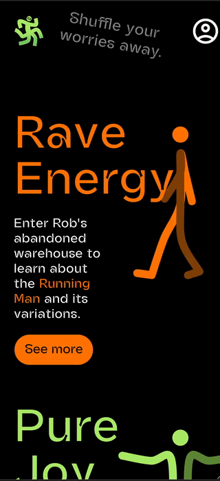
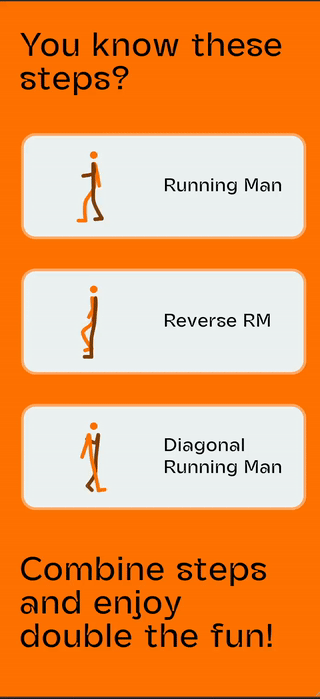
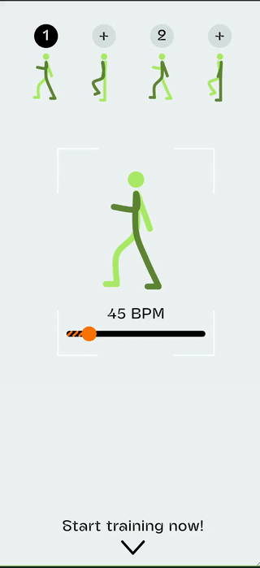
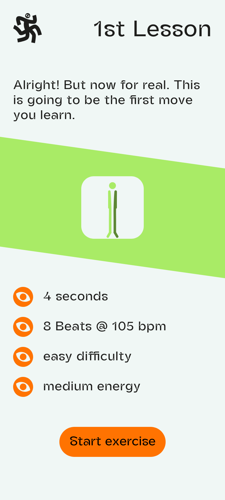
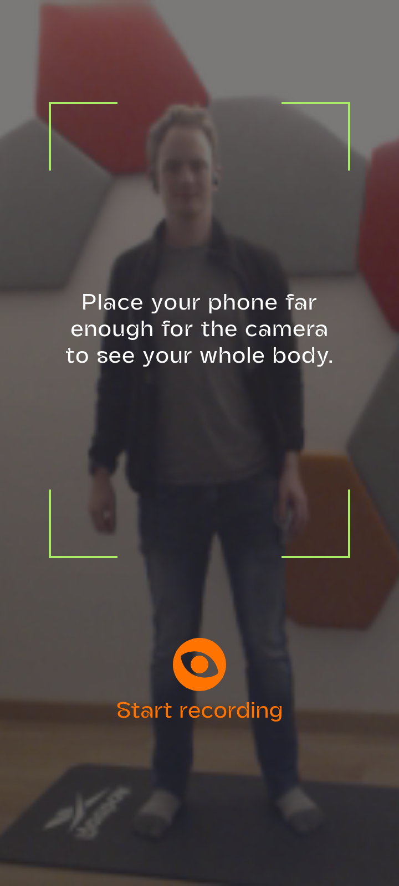
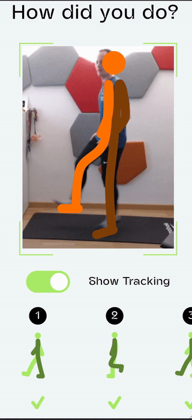

# Bouncy Feet

## Screenshots from December 2025

  
  
  
  
  
  

Try it: [app.bouncy-feet.ch](https://app.bouncy-feet.ch)

A web app that assists you in learning to shuffle dance. Bouncy Feet shows you
new moves and helps you review your progress.

The app can be installed as a Progressive Web App or used directly in the
browser like any other web page. It should work in all major browsers, on the
phone, on a laptop, and on desktop computers.

Check out the video below to see it in action. (Prototype version from 2024)

https://github.com/user-attachments/assets/e327061d-69b1-40e4-9731-6cb322f77109

## Why would I need an app for dancing?

Let's be honest, dancing is best without interacting with your phone or laptop.
Just play some music and go. The app is designed with this principle in mind and
tries to support you without getting in your way.

**Video Platform**: Tired of sharing private dance videos through chats and
losing them becaus of a lack of organization? Bouncy Feet want to become the
best place to upload videos and share them privately.

**Easy Review**: After a dance, you can review your video recording. Bouncy Feet
enhances the recording with timestamps and body positions it detects on the
beat. If you like the video, save and share it. Otherwise, delete the video and
it is gone forever. (BouncyFeet is perfectly private and doesn't upload the
video without your permission. By default, everything is processed on your
device only.)

**Browse a Collection of Moves**: An ever-growing list of shuffle moves are
available in the app to inspire you. Other dance styles are also being added.

**Stay Motivated**: Incremental statistics counting how many steps you danced in
your lifetime using the app motivates you to stay fit and active.

**And more in the future**:
- Attach video tutorials to moves in the collection.
- Combine moves to choreographies. Learn them with an interactive audio guide.
  Share the choreography with friends to practice at home and next time you meet
  you will be able to dance it together in synchrony.
- Easy video editing with filters and custom 3D models dancing next to you or
  instead of you.

**But never forget**: Dancing is physical, not digital. An app will not replace
your visit at the dance studio where you meet your friends and sweat alongside
them. Bouncy Feet the app works best when you forget that it's even recording
you while you dance. Bouncy Feet is designed to be useful to you while
minimizing the screen time of you using it.

## About the Project

At its core, Bouncy Feet is an attempt of myself to create a product which
people actually want to use. Including myself, as the user number one.

In October 2023, I quit my fulltime job to become a freelancer and also work on
creative projects on the side. After a few weeks, this idea of a dance app came
to me and I decided to start working on it.

In August 2024, Bouncy Feet GmbH was founded in Switzerland as a private limited
company, with the purpose to promote (shuffle) dance by means of software
assistance. Practically speaking, it's still just me running the show. But it
opens the door to commercial partnerships and brings legal clarity for an upcoming
release to the Play Store and the App Store.

Throughout the year of 2025 I have started organizing in-person dance events.
Now I am working together with the community to what features in Bouncy Feet
would be most loved.

It is still a bit unclear where this project will end up exactly. I am pretty
certain that to reach as many people as possible, the app should always be
available for free in some form. Monetization could work through content, like
courses by professional dance teachers, directly integrated with the software.
Paid premium features are also a possibility but let's see how things turn out.

Regarding tech, the project uses [SvelteKit](https://kit.svelte.dev/) for
everything UI, [MediaPipe](https://developers.google.com/mediapipe) with
pre-trained models for basic pose detection, and Rust (in the browser using WASM)
for the core business logic (dance detection).

## Progress Status

*Last update 22th of December 2025*

- There is a huge backlog of features not yet deployed on app.bouncy-feet.ch that needs more testing before the next big release. Including:
  - User account management
  - Video upload
  - Clubs of users to share videos in private groups
  - More courses

Stay tuned for an updated version coming soon.

# Free and Open-Source Commitment

Bouncy Feet is developed according to Free and Open-Source principles. I found
that my own opinions align well with those values, as I will elaborate a bit
more below.

I am a strong proponent of software with openly accessible source code, for two
main reasons.

1. I personally love it when I am able to look at the source code of software I
   use. It can be a great learning experience to look at real code and the
   process of how that code came to be.
2. I admire the community aspect of successful open-source projects. People use
   it to learn and practice their favorite technologies beyond what would be
   possible at a day-to-day job. This is the perfect counterweight to big
   cooperations in the software space.

I also believe that software should serve its users, rather than the oppress
them. It annoys me when software does things I don't want, without any way for
me to fix it. Consequently, I will avoid creating such software as much as I
can.

In other words, I support the free software movement and want this project to
adhere to its philosophy.

## License

This project is developed under a free and open-source license.
Specifically, AGPL version 3 or later. ([LICENSE](./AGPL-3.0-or-later.md))

In layman's terms, you may reuse the code of Bouncy Feet for other projects,
commercial or not, as long as you don't distribute that project in ways that
disrespect the freedom of their users. In particular, your project also has to
be free and open-source under AGPL version 3 or later, if you distribute it.

The purpose of this license is to ensure all users of the software developed for
the Bouncy Feet app will always have unrestricted access to the source code,
including the freedom to modify it to their desire. I hope that means any
attempt to produce derivative work with privacy invading data trackers or other
types of malware will simply be met by the community removing the offending code
and releasing the cleaned up version in a fork.

If you find the AGPL version 3 unsuitable for your use case, please contact
inbox@jakobmeier.ch and describe what you want to do with the software.
Additional licenses can be granted on a case-by-case basis. But for the general
public, it's only AGPL for now.

## Contribution

Contributions of all kinds are highly welcome!

If you want to help out with the dance content, or with translations, or
something else, please drop me a message inbox@jakobmeier.ch and I am more than
happy to discuss further. 

If you would like to help out on the coding side, that is great! Just to be
upfront about it, a lack of documentation might make it hard to get started.
Sadly, there is a chicken and egg problem here, since keeping good documentation
up to date is not worth my time until there is actual interest of contributors.

However, if you are willing to push through a lack of documentation, I am happy
to help you get started and create the necessary docs as we go. Even if you lack
experience using Rust and/or Svelte, I can help you learn. Ideally, introduce
yourself in an issue or email and let me know what you would like to work on and
we take it from there.

You may also have a look at
[issues with contribution encouraged](https://github.com/jakmeier/bouncy-feet/issues?q=is%3Aissue+is%3Aopen+label%3A%22contribution+encouraged%22).
These are typically long-term features which I know I want in the app eventually
but I don't have the capacity to work on them right now. If you want to work on
them, I will give my best to help you help me and make it a pleasant
collaboration experience for both of us.