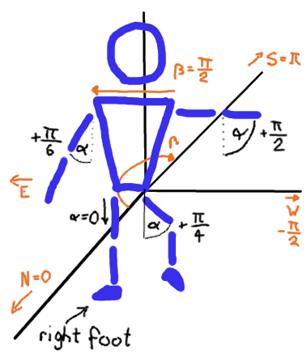

This document describes the different coordinate systems in use and what the
rational is for those choices. While most of this should also be documented as
comments in the code, this document can help to understand the big picture
without reading all of the code.

# Keypoints

Keypoints are the input to the instructor. They use a 3D cartesian coordinates
system. The x and y axis follow 2d computer graphics convention, where the y
axis grows downward and the x axis grows to the right.

Mediapipe produces landmark results in this format, so we use it for keypoints, too.

# Pose Definitions

For pose definitions in RON fils, we want maximal human-readability and
user-friendliness. Here we define the angles for a set of limbs. The format is
degrees (°) and the range is -180° to 180°, where 0° describes a leg in straight
standing position.

Each angle is relative to the body. The default positions is when all* angles
are zero. This is a person standing still and facing the camera.
Exact positions or lengths are omitted because human body shapes may differ.

\* with all angles, we mean all legs and arms. Other angles, such as hips or
shoulders, are orthogonal.

Moving a body part forward (towards the camera) makes the angle positive, moving
it backwards makes it negative. Sidewards movements are represented as "side
angles", which is defined exactly the same way just with an extra flag marking
it as side-angle. For these, positive angles are to the dancers right.

Typically, either a forward/backward or a side angle is defined, rarely would
you need to combined them. But it is possible.

**Turning the entire body is NOT part of pose definitions. This has to be defined
as part of a step.**

# Internal Pose Format and 3D Skelton

Pose definitions are converted to spherical coordinates, with a -PI to +PI
azimuth and a 0 - PI polar angle. Consequently, forward/backward is encoded
in the azimuth sign. This is the format best suited for computations.

Note that in both the pose definition as well as in the spherical coordinates 0°
means down and 180° up .

The azimuth angle (beta) is measured like a compass that the dancer holds. When
the dancer faces the camera, the azimuth is 0°, which we call north. This means
the shoulders of the dancers (from left to right) point to the east. This is
implicitly how the dancer stands in a pose.

3D skeletons, created from keypoints, also use the spherical coordinates. During
keypoint to skeleton conversion, a normalizing rotation makes the dancer face
the camera. After this, the angle comparisons to poses can ignore the
orientation of the dancer. This means we can detect every position in any
direction.

To compute an error score of two angles, we simply add up the squared error of
each element. (Until we replace it it with a more meaningful error function.)

# 2D Skeleton Projections (exported)

To draw a 2D projection of the skelton, x-y angles are computed and length
contraction factors. This allows simple 2D drawing in JS code. Angles are in [0,
2*PI), clockwise, starting at the positive x-axis.

The 2D projection reverses the azimuth normalization.
