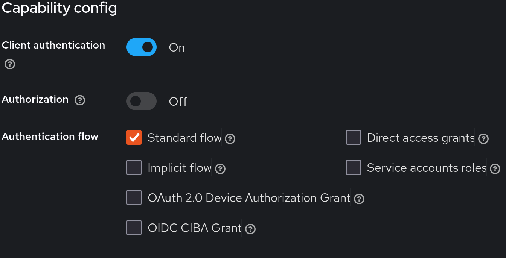
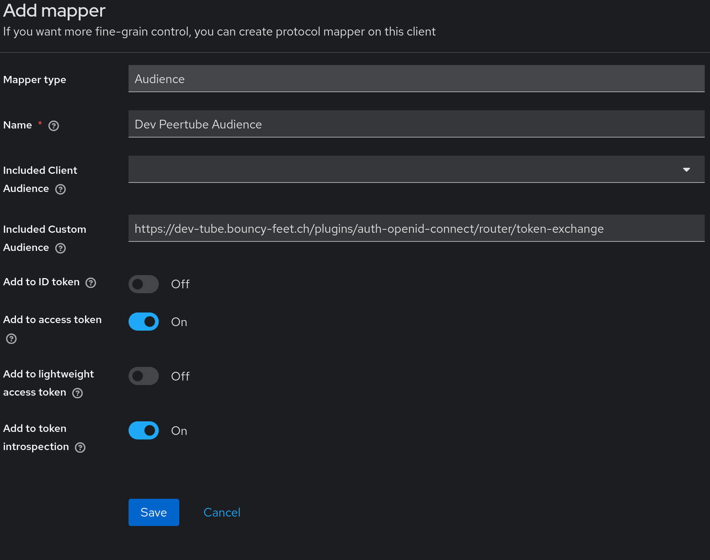
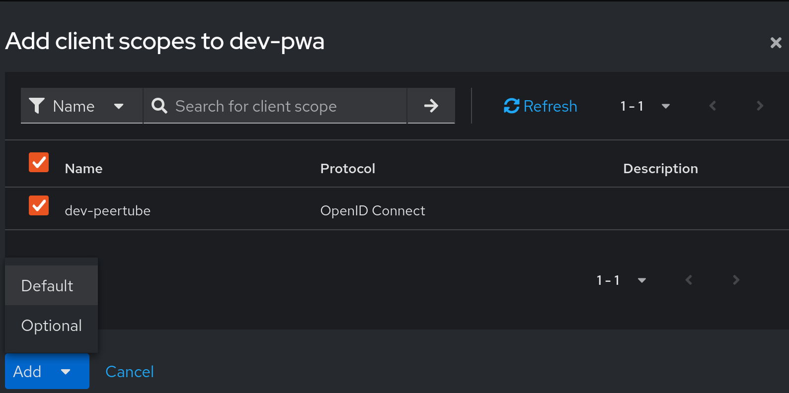

# User authentication and authorization principles

BouncyFeet follows the principle that all resources should be as open as possible without giving up user privacy or security.
Content shared as public to all BouncyFeet users should also be available to unregistered, anonymous users.

When authorization is required in a service, this service should only have the minimum amount of necessary data about the user.
Often, this is just a unique user identifier plus a authorization assertion.

## For what a login is not required

Public resources on BouncyFeet are accessible without a login, hence there is no need for user authentication.

User data, such as course progression, is primarily stored in local storage of the user's device. Again, no authentication is necessary.

## For what a login is required

Uploading data to BouncyFeet servers for persistent storage always requires user authentication and in most cases authorization.
Examples of data include dance videos, user progression backup, and opt-in usage statistics.

# Technical AUTH implementation

BouncyFeet uses a central Identity Provider (IdP) on https://auth.bouncy-feet.ch.
It runs a [Keycloak](https://www.keycloak.org/) instance.
Each BouncyFeet service has a registered client, preferably using the OpenID Connect protocol.

Below is a list of services and how they use the IdP.

## BouncyFeet main app frontend <-> API server

Login:
The frontend communicates with the API server to complete an [Authorization Code Flow](https://datatracker.ietf.org/doc/html/rfc6749#section-4.1).
The access token remains on the backend server, never to be revealed to the user.
Cookie-based sessions are used to authenticate the user.

Authorization:
The backend checks user permissions, currently only based on the user id.

Keycloak configuration:
Only the standard flow enabled.
Client must be authenticated (using client_id + client_secret).

## BouncyFeet JWT in the frontend

When the app makes authenticated requests directly from JavaScript, for example to BouncyFeet's PeerTube instance, it uses a JWT that it can obtain from Keycloak without a backend server.

Login:
The frontend JS code directly connects to Keycloak and completes a [Authorization Code Flow with Proof Key for Code Exchange (PKCE)](https://datatracker.ietf.org/doc/html/rfc7636).
The JWT is stored in the user client in JS memory.

Authorization:
The JWT lists audiences for which the token can be used for access, which other services can check for authorization. 

Keycloak configuration:
Only the standard flow enabled.
Client authentication disable.

Additionally, an audience-mapper needs to be installed for each service that can be accessed with this JWT. (See configuration section in those services)

## BouncyFeet's PeerTube instance

This is the default PeerTube frontend.
See [BouncyFeet's PeerTube API access](#bouncyfeets-peertube-api-access) for direct access from the BouncyFeet frontend.

Login:
Vanilla [PeerTube](https://github.com/Chocobozzz/PeerTube) handles user management internally, with a bundled OAuth 2.0 server for API access.
BouncyFeet's instance disables the default user type and only allows users created through the [OpenID Connect plugin](https://framagit.org/framasoft/peertube/official-plugins/tree/master/peertube-plugin-auth-openid-connect).

Authorization:
Permissions in PeerTube.

Keycloak configuration:
Only the standard flow enabled.
Client must be authenticated (using client_id + client_secret).

PeerTube configuration:

- Requires the [OpenID Connect plugin](https://framagit.org/framasoft/peertube/official-plugins/tree/master/peertube-plugin-auth-openid-connect)
- Discover URL must be configured to `https://auth.bouncy-feet.ch/realms/bouncyfeet/.well-known/openid-configuration`
- Client ID and Client secret must be copied over from Keycloak

## BouncyFeet's PeerTube API access

This is for direct access from JS code in the BouncyFeet app to the PeerTube API, for example to upload a video.

Login:
Use a JWT as described in [BouncyFeet JWT in the frontend](#bouncyfeet-jwt-in-the-frontend) and send it to the token-exchange endpoint from the OpendID connect plugin. This yields a token usable on PeerTube's API.

Authorization:
Keycloak puts the PeerTube token exchange endpoint in the JWT audience.
Final API accesses are authorized by permissions in PeerTube.

Keycloak configuration:
Configure the exact token exchange URL (e.g. https://tube.bouncy-feet.ch/plugins/auth-openid-connect/router/token-exchange) to be included in the audience. We use a client scope with a audience mapper for this. The mapper must be in a client scope that is added as "default" type to the client for the PWA frontend.

PeerTube configuration:
No additional config other than described in [BouncyFeet's PeerTube instance](#bouncyfeets-peertube-instance).
